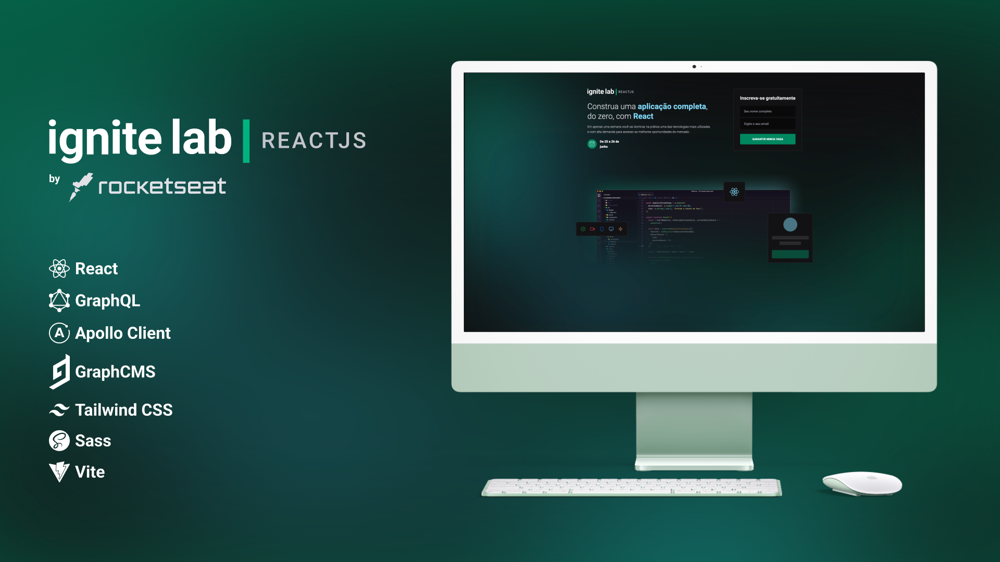
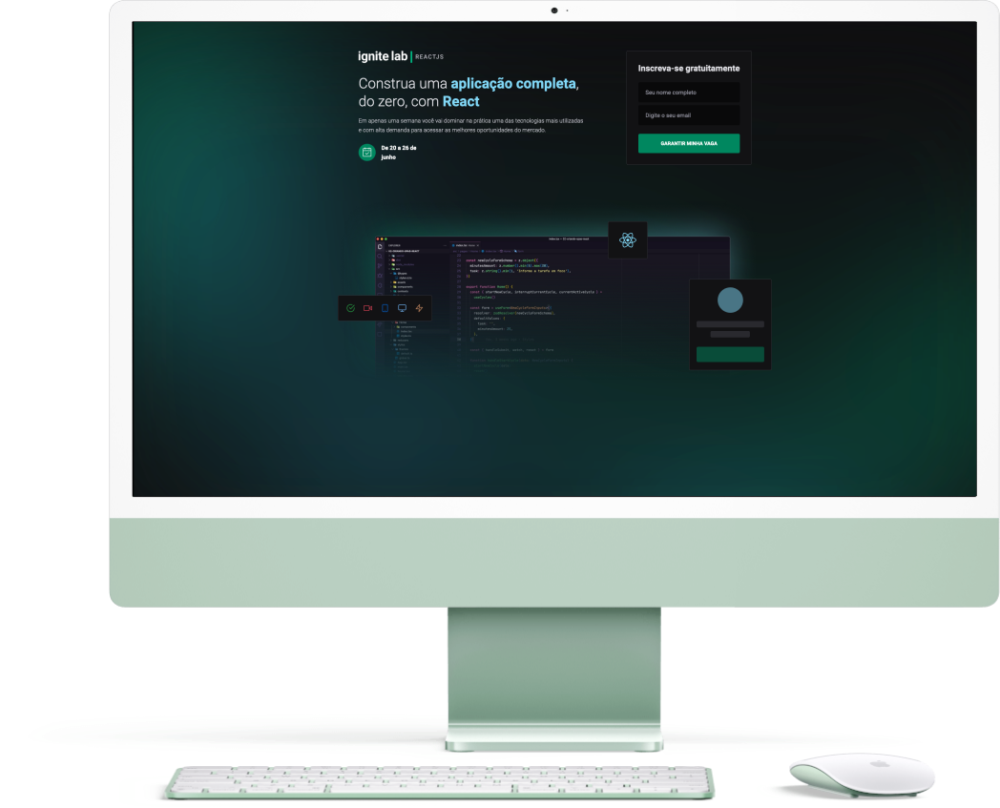
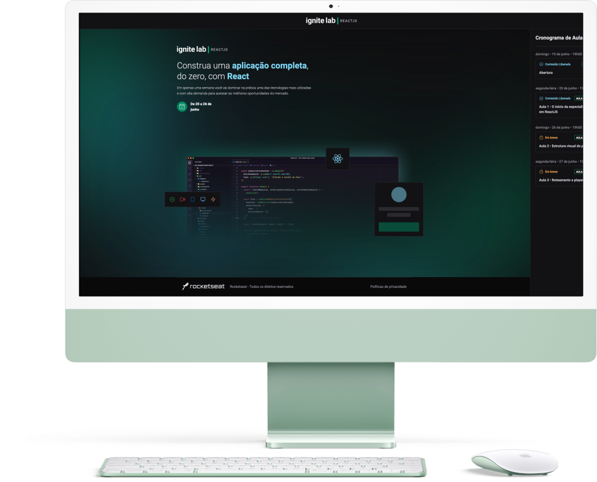
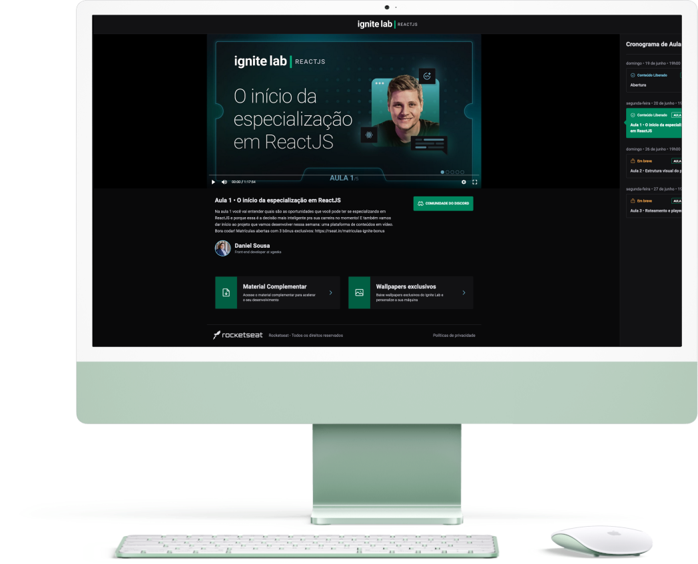

 

## 🛠 Skills

![react][react] ![graphql][graphql] ![apollo client][apollo] ![sass][sass] ![tailwind css][tailwind] ![vite][vite]

## 📄 Roadmap

- [x] Use **Sass** ( `.scss`) and use the  `@apply`from **Tawildin CSS** to avoid longer `classNames` on **JSX**;
- [x] Use same layout as home page (without form) to shwo on route ´/event` when user don't select any lesson;
- [x] Protect coming soon lessons;
    - If user try access the `/event/lesson/:slug` route manually, is redirected to previous route;
    - The lesson card renders a `div` instead a `Link` for coming soon lessons.
- [x] Storage event details on **GraphCMS**
- [x] **Docker** files (`docker-compose.yaml` and `Dockerfile`) to run project inside Docker, but in development mode;
- [ ] Implement Loading screens;
- [x] **ESLint** configuration;
- [x] Add **Husky** and **Lint Staged** to run on each commit;
- [x] Add **Commit Lint** to follow the guidelines on commit messages;

## 💾 Environment Variables

To run this project, you will need to add the following environment variables to your `.env` file:

- **`VITE_APP_API_URL`:** **GraphCMS** API Link (used on **Apollo Client**)
- **`VITE_APP_API_TOKEN`:** **GraphCMS** Token (used on **Apollo Client** to)

## 🌐 Live Version

## 🌠 Screenshots

 

## 🔗 More About Me

[react]: https://img.shields.io/badge/react-1E4174?style=for-the-badge&logo=react&logoColor=white

[graphql]: https://img.shields.io/badge/graphql-1E4174?style=for-the-badge&logo=graphql&logoColor=white

[apollo]: https://img.shields.io/badge/apollo%20client-1E4174?style=for-the-badge&logo=apollographql&logoColor=white

[sass]: https://img.shields.io/badge/sass-1E4174?style=for-the-badge&logo=sass&logoColor=white

[tailwind]: https://img.shields.io/badge/tailwind%20css-1E4174?style=for-the-badge&logo=tailwindcss&logoColor=white

[vite]: https://img.shields.io/badge/vite-1E4174?style=for-the-badge&logo=vite&logoColor=white